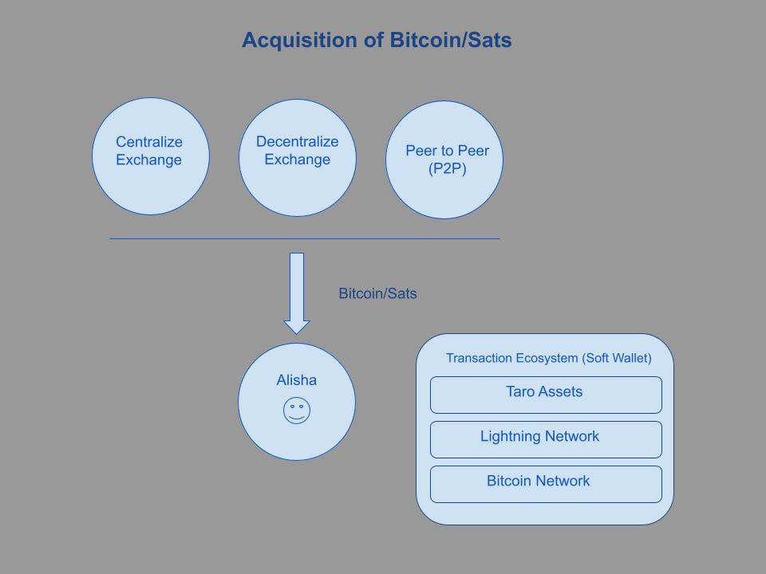

# Intention and Background of this Project

The following are a series of diagrams meant to illustrate a use case and show the different steps and actions a user (Alisha) would take using the Bitcoin, Lightning and a synthetic USD minted Taro asset (root USD).

(above is showing the principles of a Bitcoin Based Monetary Ecosystem)

* **Bitcoin** (both the network and the asset) are the foundation. Here the Bitcoin asset fulfills the monetary role of holder of value since it represents digital scarcity. The Bitcoin Network offers final settlements guaranteed by proof of work and the blockchain.

* As Bitcoin literacy and adoption grow **Satoshis** represent the monetary role of ethical medium of exchange for goods, services, labor and expertise without a third party intermediary (private banks).

In USD denominated economies, a synthetic USD native to **Taro** will fulfill the role of unit of account. People using Bitcoin as their primary economic/monetary ecosystem will find it easy to transact in day to day economic activities within their IRL communities.

Here we show our user Alisha who has acquired some Bitcoin by either:

 * purchasing it on an centralized exchange (CashApp, Binance, Paypal, Venmo, Strike etc.)

* Purchasing from a decentralized exchange (i.e. Bisq or Robosats)

* or through the Bitcoin Peer to Peer Network.

I am excluding mining from the options for simplicity’s sake, however the following scenarios would still apply.

## The portion below is what is explore with this project

Alisha would then convert Sats into synthetic USD (root USD, rUSD) for expenses. 

Now that Alisha has some sats in her Lightning Network enabled wallet she will be able to convert them into synthetic dollars (root USD or rUSD), the way the flow will work is:

Alisha has satoshis in her wallet and wants to convert them into rUSD

In the wallet or via command line (cli) she would execute the Discreet Log Contract associated with converting satoshis into rUSD. Here the Oracle plays the role of both providing the BTC/USD price action and offering assurance that the rUSD will be redeemable by third parties supporting and trusting the Oracle. (This could enable different companies to compete to fulfill the contract by offering the lowest conversion fees.) Once Alisha finds a suitable price she then enters the contract by providing the amount of satoshis to convert to rUSD plus the fee and the total amount is subtracted from her wallet.

Once the necessary amount of Satoshis is provided, the rUSD is minted by the Taro protocol and is available in Alisha’s wallet as a Taro asset

Alisha can then spend her newly minted rUSD directly with other peers see the diagram below:

The examples above assume that both Jose and Mohamed have Taro enabled Lightning Network (LN) wallets. That being the case Alisha is transacting at the speed of light during her day to day without a third party intermediary.

But what if Jose and/or Mohamed don’t have a Taro enabled LN wallet? Let's explore the scenario where fiat is necessary to transact and provide final settlement.

Here we explore the scenario where Alisha has to get fiat cash or an electronic equivalent to transact (If all goes well, this will be irrelevant in a few years.) In this case, Alisha has her rUSD in her wallet with some options to convert:

She could transfer the rUSD from her custodial wallet to her CashApp account and get fiat dollars. (If she went through the KYC process, she would not be limited in the amounts she could convert.) There may be other Lightning-enabled apps doing the same (i.e. Strike).

She could go to a Lightning-enabled centralized exchange and have her rUSD converted to fiat. Depending on the jurisdiction, Centralized Exchanges require users to go through KYC verification.

She could use a Lightning Network ATM.

In the above diagram we see a simplified zoomed out view of how Alisha interacts with both the Bitcoin/Lightning and Fiat ecosystems. 
